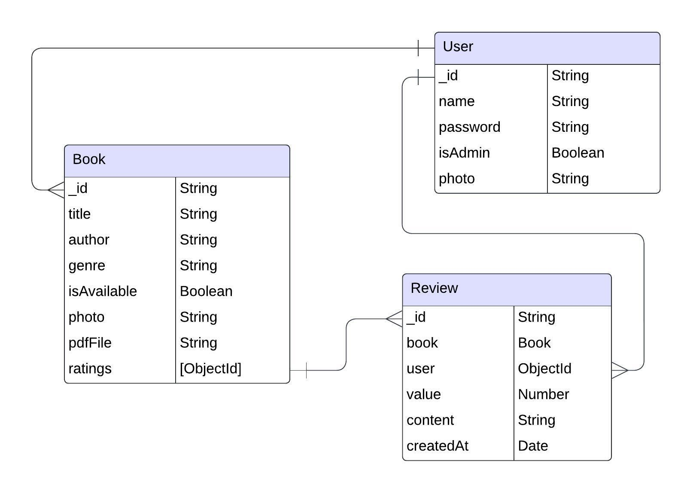

***Online Book library app***
---------------------------------------------------
**Team members :**
- Moosa Jameel
- Ahmed Yousif 
- Noor Husain

**Trello board link :**
https://trello.com/invite/b/67505bdd64c4b46ff51dfbfb/ATTI3e9abfb59aa1c0f1d434e2e008f9e79fE13758E4/online-book-library

----------------------------------------------------

online app allows the user to check whether the book is available or not.
The user will be able to get the book in PDF format.

the app  will initially ask the user to create an account with the username and password.

**Through the App, the user will be able to:**
1. Check the availability of books.
2. put a comment on the book.
3. rate the book after reading.
4. get the book in PDF format.

-----------------------------------------------------
**Project ERD:**
---------------------------------------------------

**User stories:**
----------------------------------------------------
1. As a new user, I want to create an account so that I can access the library’s book collection.
2. As a registered user, I want to log in securely using my username and password.
3. As a user, I want to reset my password if I forget it, so that I can regain access to my account.
4. As a user, I want to search for books by title, author, or genre so that I can find books that interest me.
5. As a user, I want to view detailed information about a book, including a summary, author, and ratings. 
6. As a user, I want to rate books I’ve read, so that I can share my opinion and help other users make informed decisions.
7. As a user, I want to write reviews for books I’ve borrowed, so that I can share my experience with others.
8. As a user, I want to receive a notification when a book I am interested in is available

**Wirefreames:**
----------------------------------------------------
**register page:**

**Login page:**

**Available Books page:**

**Creat Book page (Owner only):**

**Book page:**

**List of unsolved problems:**
--------------------------------------------------
1. search for the book by title. 
2. borrow option which the app must be linked 
to a real library.

**Future enhancements:**
-------------------------------------------------
1.  The app can combine several libraries, Which makes it easier for the user to find the desired book.
2.  Dividing books into different categories to facilitate the user's search process
3.  Add book summary.